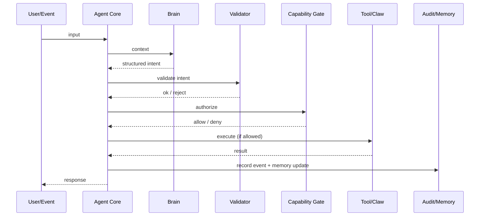

# Runtime Architecture

**Version:** 1.0.0  
**Date:** 2026-02-25  
**Status:** Architecture Reference  
**License:** Apache-2.0

---

## 1. Scope

This document defines the **reference runtime architecture** for FemtoClaw, including subsystem responsibilities, interfaces, and data/control flow. It is intended for:

- runtime implementers
- security reviewers
- operators deploying FemtoClaw in production

---

## 2. Subsystems

FemtoClaw consists of the following subsystems (normative):

1. **Agent Core**
2. **Brain Interface**
3. **Protocol Validator**
4. **Capability Gate**
5. **Claw Execution Layer**
6. **Memory Subsystem**
7. **Observability Layer**

---

## 3. Control flow

FemtoClaw’s canonical cycle:

1. **Think** — request inference from Brain Interface
2. **Validate** — enforce strict protocol compliance
3. **Authorize** — apply capability gate policy
4. **Execute** — run selected Claw(s)
5. **Record** — memory + audit/event emission
6. **Respond** — produce user response

---

## 4. Agent Core responsibilities (normative)

Agent Core MUST:
- maintain state machine for execution
- assemble context from memory and current event
- dispatch to Brain Interface
- route outputs through Validator and Capability Gate
- enforce timeouts and budgets (CPU/time/memory)
- emit observability events

Agent Core MUST NOT:
- execute OS actions directly (all actions via capabilities)

---

## 5. Brain Interface responsibilities (normative)

Brain Interface MUST:
- provide a stable abstraction over inference providers
- accept messages/events as input context
- return *only* raw inference output (which will be validated)

Brain Interface SHOULD:
- support local inference and remote inference providers
- support deterministic “test brain” for compliance/benchmarks

Brain Interface MUST NOT:
- call tools
- bypass protocol validation

---

## 6. Memory subsystem

Memory subsystem MUST:
- provide bounded short-term memory (STM) suitable for deterministic behavior
- record executed actions and results (episodic audit stream)

Memory subsystem SHOULD:
- support optional persistent/semantic memory backends
- allow privacy-first deployment patterns (local-only persistence)

---

## 7. Observability layer

Observability MUST capture:
- validation failures vs authorization denials vs execution errors
- per-step latency
- capability invocation metadata (tool name, policy decision, result category)
- correlation IDs for tracing

Recommended signal formats:
- JSON logs
- OpenTelemetry traces/metrics (optional integration)

---

## 8. Non-goals

FemtoClaw runtime architecture does not mandate:
- a specific inference model or provider
- a specific vector database
- a specific policy engine vendor

Those are pluggable concerns bounded by the validator and capability gate.
