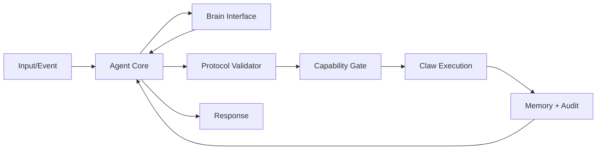

# FemtoClaw — Industrial Agent Runtime
## White Paper

**Version:** 1.0.0  
**Date:** 2026-02-25  
**Status:** Public / Production Definition  
**License:** Apache-2.0  

---

## Abstract

FemtoClaw is an **industrial agent runtime**: a lightweight, Rust-based execution authority that safely mediates probabilistic inference systems and deterministic computing environments. FemtoClaw establishes strict protocol validation, capability-gated execution, and production-grade observability so that inference-driven automation can be deployed safely in enterprise environments.

FemtoClaw is not an orchestration framework. FemtoClaw is not a collection of prompts. FemtoClaw is the **runtime authority** that decides what may execute, under which constraints, and with which audit trail.

---

## 1. Problem: probabilistic intent vs deterministic systems

Inference systems generate outputs that may be:
- ambiguous
- non-deterministic
- unsafe if executed directly

Operating systems, however, require:
- strict input validation
- deterministic execution semantics
- principle-of-least-privilege access

Without an execution authority between these two worlds, agent deployments accumulate risk.

---

## 2. FemtoClaw’s solution

FemtoClaw introduces a deterministic control boundary:

1. **Inference produces intent** (structured output only)  
2. **FemtoClaw validates intent** (protocol + schema + policy)  
3. **FemtoClaw gates execution** (capabilities explicitly registered)  
4. **FemtoClaw records execution** (audit events, metrics, traces)  
5. **FemtoClaw responds** (result mediation)

This is the industrial runtime model.

---

## 3. Core design goals

### 3.1 Correctness
- Execution MUST be explainable and auditable.
- Non-conformant protocol outputs MUST be rejected.

### 3.2 Safety gates
- Tools (“Claws”) MUST be deny-by-default.
- System-impacting operations MUST require explicit enablement and policy approval.

### 3.3 Observability
- Each step MUST emit structured events for tracing and audit trails.
- Failures MUST be categorized (validation, authorization, execution, infrastructure).

### 3.4 Performance and portability
- Single binary distribution.
- Efficient cold start suitable for CI and edge.
- Runs anywhere Rust runs (macOS/Linux/Windows, x86_64/arm64, containers).

---

## 4. Runtime architecture overview

Key concept: the inference engine never directly executes anything.

---

## 5. Industrial deployment posture

FemtoClaw is designed for:

- **Enterprise automation:** controlled remediation, scripted incident response, safe ops assistants
- **CI/CD pipelines:** build failure analysis and approved remediation steps
- **Edge and air-gapped environments:** local inference, local policy, no required cloud connectivity

FemtoClaw integrates with existing enterprise controls:
- OS privilege models (user/service/root)
- corporate policy engines and allowlists
- audit logging systems

---

## 6. Security and trust boundaries

FemtoClaw enforces two critical boundaries:

1. **Protocol boundary**: only allowed structured outputs are accepted.
2. **Capability boundary**: only registered capabilities can execute, and only within configured policy.

FemtoClaw does not bypass the OS security model. It operates within it.

---

## 7. Conclusion

FemtoClaw defines a new class of infrastructure: **the industrial agent runtime**.
It makes inference useful in production by ensuring that execution is deterministic, authorized, and observable.
